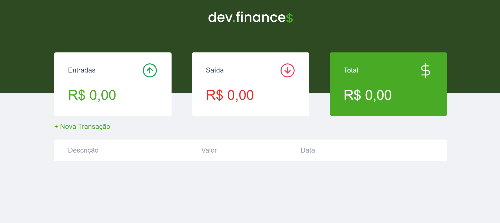

<div style="display:inline; list-style: none;" align="center">
    <a href="#-Como-executar-o-projeto">🚀 Como executar o projeto</a>
    <a href="#-Pré-requisitos">📑 Pré-requisitos</a>
    <a href="#-Tecnologias">⚡ Tecnologias</a>
</div>



## **🚀 Como executar o projeto**
```bash
# Clone este repositório
$ git clone https://github.com/Leandro-Bezerra-Santos/System-Finance.git

# Clique no arquivo index.html para abrir

# PRONTO!
```

### **📑 Pré-requisitos**
1. Tenha o Git instalado no seu S.O


## **⚡ Tecnologias**

- Html 5
- Css 3
- JavaScript

Caso Tenha curiosidade em ver video acesse:
https://www.linkedin.com/in/leandro-bezerra-/
